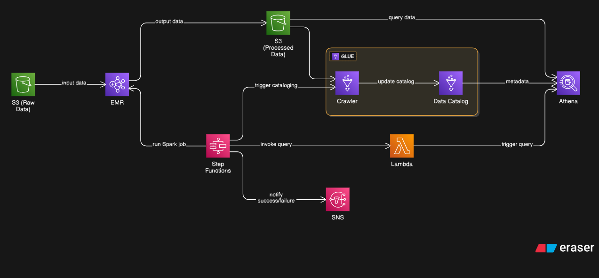

# Car Rental Data Pipeline on AWS

This repository contains a fully functional big data processing pipeline tailored for a car rental marketplace. The pipeline is built using key AWS services including EMR (Elastic MapReduce), Apache Spark, AWS Glue, AWS Athena, AWS Step Functions, and AWS Lambda to deliver a robust, scalable, and automated analytics solution.

---

## Project Overview

The goal of this project is to process, analyze, and generate key performance insights from car rental data in a cost-effective and automated way. The architecture supports batch processing using Apache Spark and facilitates serverless querying, orchestration, and notifications for end-to-end automation.

---

## Architecture Flow

```
S3 (Raw Data)
   |
   v
EMR (Spark Jobs: ETL)
   |
   v
S3 (Processed Parquet Data)
   |
   v
Glue Crawler -> Glue Data Catalog
   |
   v
Athena (Query Engine)
   |
   v
Lambda (Automated Queries)
   |
   v
Step Functions (Orchestration and SNS Notifications)
```

---

## Datasets Used

All input datasets are stored in Amazon S3 in CSV format.

- `vehicles.csv`: Contains metadata about rental vehicles including type and license info.
- `users.csv`: Information about registered users including sign-up and license details.
- `locations.csv`: Details about pickup and drop-off locations.
- `rental_transactions.csv`: Main transactional dataset containing rental activities.

---

## Spark Jobs on EMR

The data is processed using Apache Spark running on AWS EMR. Two jobs are implemented:

### 1. user_transaction_analysis.py
- Processes the rental transaction dataset to derive per-user metrics.
- Metrics include total transactions, spending, average rental duration, and transaction ranges.
- Outputs data into `user_metrics` and `daily_metrics`.

### 2. vehicle_location_metrics.py
- Aggregates rental data by vehicle type and pickup location.
- Computes total revenue, transaction counts, min/max/avg transaction values, and unique vehicle usage.
- Outputs data into `location_metrics` and `vehicle_type_metrics`.

All processed results are stored back in Amazon S3 in optimized Parquet format for fast querying.

---

## Glue and Athena Integration

AWS Glue is used to crawl the processed Parquet files and update the Glue Data Catalog with the latest schema information. AWS Athena is then used to run SQL queries directly against the transformed data stored in S3.

Common insights generated through Athena:
- Identify the highest revenue-generating location.
- Determine the most frequently rented vehicle type.
- List top-spending users.

---

## Step Functions Workflow

The workflow is orchestrated using AWS Step Functions, ensuring automation and proper sequencing of the entire pipeline. The steps include:

1. Create the EMR cluster
2. Run the two Spark ETL jobs
3. Trigger the Glue Crawler to update the catalog
4. Invoke Lambda function to query Athena
5. Terminate the EMR cluster
6. Send a success or failure notification using SNS

---

## Lambda Function

A Lambda function (`rental_lbd`) is triggered as part of the Step Functions flow. It runs predefined Athena SQL queries and stores or logs the output for review. It helps ensure that insights are extracted automatically after the ETL process completes.

---

## Output Tables in Glue and Athena

| Table Name             | Description                                  |
|------------------------|----------------------------------------------|
| `daily_metrics`        | Tracks revenue and transaction volume daily  |
| `user_metrics`         | Tracks user-level engagement and spending    |
| `location_metrics`     | Tracks KPIs per rental location              |
| `vehicle_type_metrics` | Tracks KPIs per vehicle type                 |

---

## IAM Roles and Permissions

The following IAM roles are required for seamless integration between services:

| IAM Role                   | Purpose                              | Required Permissions                           |
|----------------------------|---------------------------------------|------------------------------------------------|
| `EMR_DefaultRole`          | EMR cluster role                      | `AmazonElasticMapReduceRole`                   |
| `EMR_EC2_DefaultRole`      | Permissions for EMR EC2 instances     | `AmazonElasticMapReduceforEC2Role`             |
| `StepFunctionExecutionRole`| Orchestrates services via Step Functions | `glue:*`, `emr:*`, `lambda:InvokeFunction`, `sns:Publish` |
| Lambda Execution Role      | Used by Athena Lambda function        | `athena:*`, `s3:GetObject`, `s3:PutObject`      |

Ensure these roles are properly attached and trust relationships are configured to allow services to assume the necessary roles.

---

## Notifications via SNS

AWS Step Functions uses Amazon SNS to notify stakeholders at the end of the pipeline execution.

- Success Notification: Sent when the full workflow completes without error.
- Failure Notification: Sent immediately if any step fails.

---

## Execution Guide

1. Upload your Spark job scripts to S3 (e.g., `s3://your-code-bucket/scripts/`)
2. Place raw datasets in the S3 bucket path (e.g., `s3://your-raw-bucket/raw_data/`)
3. Create and configure Glue Crawler to point to the processed output path.
4. Deploy the Lambda function for Athena query automation.
5. Launch the Step Function to trigger the full pipeline.

---

## Key Business Metrics Computed

- Revenue and transaction volume per location
- Max, min, and average transaction values
- Total rental hours and revenue per vehicle type
- User-specific rental behavior and spending patterns
- Daily business performance tracking

---